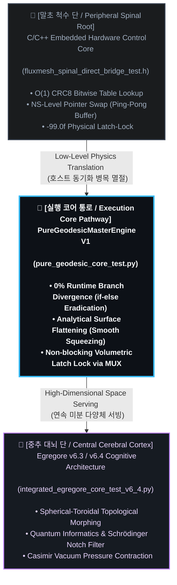

## 🧬 Core Lineage & Architectural Evolution (코어 계승 및 아키텍처 진화 기원)

### [KR]
`PureGeodesicMasterEngine V1` 본 가속기 모듈은 저수준 임베디드 제어 단의 **말초 척수 반사(Spinal Reflex)** 메커니즘과 고차원 인지 AI 단의 **중추 대뇌 피질(Cerebral Cortex)** 기하학 수식을 융합하는 과정에서 구상해 본 하드웨어-지능 일체형 아키텍처의 통로입니다.

### [EN]
`PureGeodesicMasterEngine V1` is the conceptual ingestion pathway of a hardware-intelligence unified architecture, envisioned during the process of fusing the low-level **Peripheral Spinal Reflex** mechanisms of embedded control with the high-dimensional geometric formulations of the central **Cerebral Cortex** AI layer.

### 1. The Spinal Root: Low-Level Hardware Survival (말초 척수 단의 유산)

- **[KR] 기원 (Origin):** 초고속 마이크로초($\mu s$) 단위 생체 신호 인터페이스 제어용 `fluxmesh_spinal_direct_bridge_test.h` 저수준 소스코드.
- **[EN] Origin:** The low-level source header `fluxmesh_spinal_direct_bridge_test.h`, engineered for ultra-low latency, microsecond-scale ($\mu s$) bio-signal interface control.

  
- **[KR] 계승 메커니즘:** 임베디드 단에서 전자기 노이즈 및 센서 단선 등의 IEEE-754 `NaN` 비트 폭주 포착 시, 인터럽트 제어 분기문 없이 하드웨어 비트 레벨에서 출력을 즉시 $-99.0\text{f}$ 전위로 고정해 자폭 격리($Apoptosis$)하던 락-프리(Lock-Free) 생존 본능을 계승했습니다.
- **[EN] Lineage Mechanism:** Inherits the lock-free survival instinct of the embedded layer which, upon capturing IEEE-754 `NaN` bit surges from electromagnetic noise or sensor detachment, immediately dead-locks the output to a $-99.0\text{f}$ potential for apoptotic self-isolation without relying on interrupt control branches.

- **[KR] 진화:** 본 가속 엔진은 이 저수준 척수 반사 제어를 GPU/NPU 스트림 파이프라인 내부로 완벽히 흡수하여, 단 한 줄의 비트 MUX 수식(`torch.where`)만으로 호스트-디바이스 간 blocking 병목을 유발하지 않는 무정지 **Rule 5 Latch Lock** 장벽으로 진화시켰습니다.
- **[EN] Evolution:** This acceleration engine seamlessly absorbs this low-level spinal reflex control directly into the GPU/NPU stream pipeline, transforming it into a non-blocking **Rule 5 Latch Lock** barrier that bypasses host-device synchronization bottlenecks via a single-line bitwise MUX equation (`torch.where`).

### 2. The Cerebral Root: High-Dimensional Smooth Manifold (중추 대뇌 단의 유산)

- **[KR] 기원 (Origin):** 고차원 잠재 공간 항상성 수호를 위한 `integrated_egregore_core_test_v6_4.py` 인지 아키텍처.
- **[EN] Origin:** The cognitive architecture `integrated_egregore_core_test_v6_4.py`, designed for safeguarding high-dimensional latent space homeostasis.

  
- **[KR] 계승 메커니즘:** 구면-토러스 매니폴드 모핑, 슈뢰딩거 포텐셜 노치 필터링, 카시미르 진공 압착 등 고차원 다양체를 수학 수식만으로 왜곡 없이 전개하던 대수학적 공간 지배력을 계승했습니다.
- **[EN] Lineage Mechanism:** Inherits the algebraic topology control capabilities that unfold high-dimensional manifolds without geometric deformation, driven solely by mathematical formulations such as spherical-toroidal morphing, Schrödinger potential notch filtering, and Casimir vacuum pressure contraction.

- **[KR] 진화:** 대뇌 피질 아키텍처가 전개할 거대 매트릭스의 분모 붕괴 리스크와 하이퍼네트워크 부하 폭주 가능성을 사전에 수학적 경계선으로 제어하고, 가속기 내부 레지스터가 단 1클럭의 정체도 없이 수용 가능한 수식 필드로 완전히 압착 평탄화하는 가속 통로를 완성했습니다.
- **[EN] Evolution:** Establishes an acceleration pathway that preemptively constrains denominator explosion risks and hypernetwork workload surges from the cerebral matrix using analytical boundaries, completely flattening and compressing variables into differentiable mathematical fields that the accelerator's internal registers can process with zero-clock stall.
